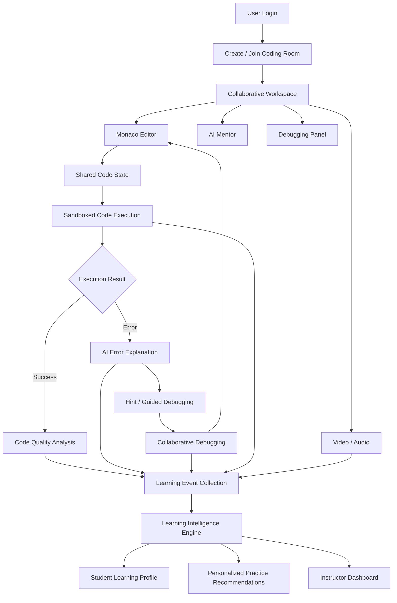

<div align="center">

# 🧠 MindCode

**AI-powered coding assessment with cognitive profiling, behavioral telemetry, and recruiter-grade analytics.**

[](https://nodejs.org)
[](https://react.dev)
[](https://www.typescriptlang.org)
[](https://supabase.com)
[](https://vitejs.dev)
[](https://tailwindcss.com)

</div>


MindCode is an **AI-powered collaborative coding platform** designed to transform the way students learn programming.

Unlike traditional coding platforms that primarily evaluate whether the final code is correct, MindCode focuses on the **entire learning process** — how learners write code, encounter errors, debug, collaborate, use AI assistance, and improve over time.

For **HackConquest Track 2 — Collaborative Real-Time Code Editor**, MindCode combines a real-time collaborative IDE with AI-assisted debugging, sandboxed code execution, collaborative problem solving, code-quality analysis, and personalized learning analytics.

---

## 🚀 Why MindCode?

Traditional coding platforms usually answer:

> **"Did the student solve the problem?"**

MindCode goes further:

> **"How did the student solve it, where did they struggle, how did they debug it, how did they collaborate, and what should they practice next?"**

### The MindCode approach

```text
                    ┌──────────────────────┐
                    │      CODING TASK     │
                    └──────────┬───────────┘
                               │
                               ▼
                    ┌──────────────────────┐
                    │  COLLABORATIVE IDE   │
                    │    Monaco Editor     │
                    └──────────┬───────────┘
                               │
                 ┌─────────────┼─────────────┐
                 │             │             │
                 ▼             ▼             ▼
          ┌───────────┐ ┌───────────┐ ┌────────────┐
          │  Execute  │ │ AI Mentor │ │ Collaborate│
          │   Code    │ │  & Hints  │ │  & Debug   │
          └─────┬─────┘ └─────┬─────┘ └──────┬─────┘
                │             │              │
                └─────────────┼──────────────┘
                              ▼
                   ┌────────────────────┐
                   │ LEARNING TELEMETRY │
                   └──────────┬─────────┘
                              │
                              ▼
                   ┌────────────────────┐
                   │ LEARNING PROFILE   │
                   │ & PROGRESS         │
                   └──────────┬─────────┘
                              │
                              ▼
                   ┌────────────────────┐
                   │ PERSONALIZED       │
                   │ PRACTICE INSIGHTS  │
                   └────────────────────┘
```

---

# 🎯 Problem Statement

Programming education is often fragmented across:

* Code editors
* Online judges
* Video conferencing tools
* Chat applications
* AI assistants
* Learning management systems
* Separate analytics dashboards

This forces learners and instructors to switch between multiple tools.

More importantly, most coding platforms focus heavily on the **final answer** rather than the **learning process**.

A student who solves a problem independently after several debugging attempts and a student who immediately copies an AI-generated solution may both receive the same "correct" result.

The learning journey is lost.

---

# 💡 Our Solution

MindCode brings the coding experience into a single collaborative environment.

### One workspace provides:

🧑‍💻 **Real-Time Collaborative Coding**
Multiple learners can edit the same code simultaneously.

🤖 **AI Coding Mentor**
Explains syntax and runtime errors, provides progressive hints, and guides learners without immediately revealing the answer.

▶️ **Sandboxed Code Execution**
Run code safely and receive execution results.

🐛 **Collaborative Debugging**
Highlight code, discuss errors, leave debugging notes, and work together toward a solution.

📹 **Integrated Communication**
Communicate with other participants without leaving the coding workspace.

🔍 **Code Quality Analysis**
Receive educational feedback about readability, complexity, maintainability, and coding practices.

📊 **Learning Intelligence**
Track meaningful coding events and convert them into actionable learning insights.

🎯 **Personalized Learning Progress**
Identify recurring error patterns and recommend concepts for additional practice.

---

# 🏆 HackConquest — Track 2 Alignment

### Track 2: Collaborative Real-Time Code Editor

MindCode addresses the major capabilities required by the problem statement:

| Requirement                    | MindCode Implementation                 |
| ------------------------------ | --------------------------------------- |
| Real-time multi-user editing   | Collaborative Monaco Editor             |
| Integrated communication       | Browser-based audio/video collaboration |
| AI syntax assistance           | AI Coding Mentor                        |
| Sandboxed code execution       | Secure execution layer                  |
| Code-quality analysis          | AI Code Quality Analyzer                |
| Collaborative debugging        | Shared debugging workspace              |
| Personalized learning progress | Learning Intelligence Engine            |

The solution is therefore not simply a collaborative editor; it combines the required collaborative development environment with MindCode's learning-intelligence layer.

---

# ✨ Core Features

## 1. 👥 Real-Time Collaborative Coding

Multiple users can work on the same coding problem simultaneously.

### Features

* Shared Monaco Editor
* Real-time code synchronization
* Multi-user presence
* Collaborator awareness
* Room-based isolation
* Reconnection support
* Shared code state

### Example

```text
Student A                    Student B
    │                            │
    │        edits code          │
    ├──────────────┐             │
    │              │             │
    ▼              ▼             │
┌─────────────────────────────────────┐
│        SHARED CODE DOCUMENT         │
│                                     │
│  for i in range(len(numbers)):      │
│      print(numbers[i])              │
│                                     │
└─────────────────────────────────────┘
                 │
                 ▼
        All participants
        see changes live
```

---

# 2. 🧑‍💻 Collaborative Coding Rooms

Every coding activity happens inside a dedicated room.

A room can contain:

* Coding problem
* Programming language
* Shared editor
* Participants
* Execution results
* AI Mentor
* Debugging discussions
* Video/audio communication
* Learning events

### Room Flow

```text
Create Room
     │
     ▼
Share Room ID
     │
     ▼
Other Learners Join
     │
     ▼
Collaborative Workspace
     │
 ┌───┼────────────┐
 ▼   ▼            ▼
Code AI        Video
     │
     ▼
Execute
     │
     ▼
Debug Together
```

---

# 3. 🤖 AI Coding Mentor

The AI Mentor acts as a **coding tutor**, not merely a code generator.

When an error occurs:

```text
Code
 │
 ▼
Execution
 │
 ▼
Error Detected
 │
 ▼
AI Mentor
 │
 ├── Explain
 │
 ├── Hint
 │
 ├── Guided Debugging
 │
 └── Full Solution
```

### Progressive Assistance

#### Level 1 — Explain

> What does this error mean?

#### Level 2 — Hint

> Which part of your loop should you check?

#### Level 3 — Guided Debugging

> Your loop may be accessing an index outside the available range.

#### Level 4 — Solution

A complete solution is shown only when explicitly requested.

### Why?

The objective is to encourage learners to **understand and fix problems themselves**, rather than making the AI solve every problem automatically.

---

# 4. ▶️ Sandboxed Code Execution

MindCode allows learners to execute code from the collaborative editor.

### Execution Pipeline

```text
┌───────────────┐
│ Monaco Editor │
└───────┬───────┘
        │
        ▼
┌─────────────────┐
│ Backend Request │
└───────┬─────────┘
        │
        ▼
┌─────────────────┐
│ Sandbox / Judge │
└───────┬─────────┘
        │
   ┌────┴─────┐
   ▼          ▼
Success      Error
   │          │
   │          ▼
   │      AI Mentor
   │          │
   └────┬─────┘
        ▼
 Execution Result
```

Possible results include:

* Successful execution
* Compilation error
* Runtime error
* Timeout
* Memory-limit failure
* Execution failure

The execution layer is isolated from the main application server.

---

# 5. 🐛 Collaborative Debugging

Debugging becomes a shared activity rather than an isolated process.

Learners can:

* Highlight a problematic line
* Add debugging notes
* Reply to another learner
* Discuss possible causes
* Apply changes
* Re-run the program
* Mark the issue resolved

### Example

```text
Student A:
"Why am I getting None here?"

        ↓

Student B:
"Check whether this function has a return statement."

        ↓

Student A:
Adds return statement

        ↓

Run Code

        ↓

✓ Successful
```

This interaction can also become part of the learner's educational progress data.

---

# 6. 📹 Integrated Video / Audio Collaboration

Learners can communicate without leaving the coding environment.

### Capabilities

* Camera on/off
* Microphone on/off
* Participant video tiles
* Audio communication
* Connection status
* Permission handling

The communication layer is intentionally lightweight so that the **coding environment remains the primary workspace**.

---

# 7. 🔍 AI Code Quality Analysis

MindCode can analyze code for educationally useful quality feedback.

### Analysis Areas

* Readability
* Naming
* Unnecessary complexity
* Repeated logic
* Maintainability
* Basic coding practices
* Potentially inefficient patterns

Instead of simply saying:

> "Code quality: 62/100"

MindCode explains **why** something could be improved.

### Example

```text
Observation:
The same condition appears multiple times.

Why it matters:
Repeated logic can make code harder to maintain.

Suggestion:
Consider extracting the condition into a helper function.
```

The system distinguishes between objective issues and subjective style preferences.

---

# 8. 🧠 Learning Intelligence

This is the core MindCode differentiator.

MindCode observes meaningful learning events throughout a coding session.

### Example events

```text
Problem opened
      ↓
Coding started
      ↓
Execution attempt
      ↓
Syntax error
      ↓
Student attempts correction
      ↓
AI hint requested
      ↓
Peer suggestion
      ↓
Second attempt
      ↓
Successful execution
```

These events can be converted into educational insights.

---

# 9. 📊 Personalized Learning Profile

Instead of only showing a score, MindCode creates a learning-oriented profile.

### Example

```text
┌─────────────────────────────────────┐
│        LEARNING PROFILE             │
├─────────────────────────────────────┤
│                                     │
│ Problem-solving progress     ████░  │
│ Debugging progress           █████  │
│ Syntax understanding         ████░  │
│ Independent attempts         ███░░  │
│ Collaboration activity       █████  │
│                                     │
├─────────────────────────────────────┤
│ RECENT OBSERVATION                  │
│                                     │
│ Repeated difficulty observed       │
│ with loop boundaries.              │
│                                     │
├─────────────────────────────────────┤
│ RECOMMENDED PRACTICE               │
│                                     │
│ • Array indexing                   │
│ • range()                          │
│ • Loop boundaries                  │
└─────────────────────────────────────┘
```

These are **learning indicators**, not psychological diagnoses or fixed judgments about a learner.

---

# 10. 👨‍🏫 Instructor / Mentor Dashboard

Authorized instructors can monitor learning activity across coding rooms.

### Dashboard can show

* Active rooms
* Active participants
* Problems being attempted
* Completion status
* Common error categories
* Execution activity
* AI assistance usage
* Collaboration activity
* Learning progress

### Student-level view

```text
Student
   │
   ├── Problems Completed
   ├── Recurring Errors
   ├── Debugging Activity
   ├── AI Assistance
   ├── Collaboration
   └── Recommended Practice
```

Access to student analytics is restricted to authorized users.

---

# 🔄 Complete System Flow



---

# 🏗️ High-Level Architecture

```text
                         ┌───────────────────────┐
                         │       FRONTEND        │
                         │                       │
                         │ React + TypeScript    │
                         │ Monaco Editor         │
                         │ Tailwind CSS          │
                         │ Zustand               │
                         └───────────┬───────────┘
                                     │
                    ┌────────────────┼────────────────┐
                    │                │                │
                    ▼                ▼                ▼
              REST APIs        WebSockets          WebRTC
                    │                │                │
                    └────────────────┼────────────────┘
                                     ▼
                         ┌───────────────────────┐
                         │       BACKEND         │
                         │                       │
                         │ Node.js + Express     │
                         │ Collaboration Layer   │
                         │ Auth / Authorization  │
                         └───────────┬───────────┘
                                     │
              ┌──────────────────────┼──────────────────────┐
              │                      │                      │
              ▼                      ▼                      ▼
       ┌─────────────┐        ┌─────────────┐       ┌─────────────┐
       │  Supabase   │        │  Judge0 /   │       │ AI Services │
       │ PostgreSQL  │        │   Sandbox   │       │ AI Mentor   │
       └─────────────┘        └─────────────┘       └─────────────┘
              │                      │                      │
              └──────────────────────┼──────────────────────┘
                                     ▼
                         ┌───────────────────────┐
                         │ LEARNING INTELLIGENCE │
                         │                       │
                         │ Event Processing      │
                         │ Progress Analysis     │
                         │ Recommendations       │
                         └───────────────────────┘
```

---

# 🧩 Technology Stack

## Frontend

| Technology        | Purpose                      |
| ----------------- | ---------------------------- |
| **React 18**      | Frontend application         |
| **TypeScript**    | Type-safe development        |
| **Vite**          | Development/build tooling    |
| **Tailwind CSS**  | UI styling                   |
| **Monaco Editor** | Browser-based code editor    |
| **Zustand**       | Client-side state management |

## Backend

| Technology     | Purpose                  |
| -------------- | ------------------------ |
| **Node.js**    | Backend runtime          |
| **Express.js** | REST API layer           |
| **WebSockets** | Real-time communication  |
| **WebRTC**     | Peer-to-peer audio/video |

## Collaboration

| Technology                           | Purpose                                |
| ------------------------------------ | -------------------------------------- |
| **Yjs / CRDT-based synchronization** | Concurrent document editing            |
| **WebSockets**                       | Real-time synchronization and presence |

## Database & Authentication

| Technology        | Purpose          |
| ----------------- | ---------------- |
| **Supabase**      | Backend services |
| **PostgreSQL**    | Persistent data  |
| **Supabase Auth** | Authentication   |

## Code Execution

| Technology                             | Purpose                |
| -------------------------------------- | ---------------------- |
| **Judge0 / sandboxed execution layer** | Safe program execution |

## AI & Intelligence

| Technology                      | Purpose                    |
| ------------------------------- | -------------------------- |
| **LLM / AI provider**           | AI Mentor and explanations |
| **AI Code Analysis**            | Code quality feedback      |
| **Learning Intelligence Layer** | Educational analytics      |

> The exact AI provider and execution provider can be configured according to the deployed environment.

---

# 🗃️ Core Data Model

```text
User
 │
 ├──────────────┐
 │              │
 ▼              ▼
Room         Learning Profile
 │
 ├── Participants
 │
 ├── Problem
 │
 ├── Code State
 │
 ├── Debugging Events
 │
 ├── Execution Events
 │
 ├── AI Interactions
 │
 └── Collaboration Events
```

### Main entities

```text
users
rooms
participants
problems
code_sessions
code_versions
execution_events
debugging_events
ai_interactions
collaboration_events
learning_events
learning_profiles
```

---

# 🔐 Security & Privacy

MindCode is designed with isolation and authorization in mind.

### Room Isolation

Users can only access rooms they are authorized to join.

### Code Execution

Student code should execute through a sandboxed execution service rather than directly on the application server.

### Authentication

Authenticated users are associated with their sessions and permissions.

### Instructor Access

Learning analytics should only be visible to authorized instructors and the relevant learner.

### AI Data Minimization

Only information required for the AI task should be sent to the AI service.

### Failure Isolation

A failure in one subsystem should not bring down the entire coding experience.

```text
AI Failure
    ↓
Editor continues working

Video Failure
    ↓
Coding continues

Execution Failure
    ↓
Collaboration continues

Analytics Failure
    ↓
Coding session continues
```

---

# 🔁 End-to-End User Journey

### Step 1 — Sign In

The learner authenticates into MindCode.

### Step 2 — Create / Join Room

A learner creates a coding session or joins an existing room.

### Step 3 — Select Problem

The coding problem and programming language are loaded.

### Step 4 — Collaborate

Participants edit the shared code in real time.

### Step 5 — Communicate

Learners can communicate using integrated audio/video.

### Step 6 — Execute

The code is submitted to the sandboxed execution environment.

### Step 7 — Debug

If an error occurs, participants can debug together.

### Step 8 — AI Assistance

The AI Mentor explains the error and provides progressive hints.

### Step 9 — Improve

The learner modifies the code and executes it again.

### Step 10 — Analyze

MindCode analyzes the resulting code and meaningful learning events.

### Step 11 — Learn

The learner receives progress insights and recommended practice topics.

---

# 🌟 What Makes MindCode Different?

Most collaborative coding tools focus on:

```text
Write Code
    ↓
Run Code
    ↓
Get Result
```

MindCode adds the learning layer:

```text
Write
  ↓
Collaborate
  ↓
Make Mistakes
  ↓
Debug
  ↓
Ask for Help
  ↓
Learn
  ↓
Improve
  ↓
Track Progress
  ↓
Personalize Practice
```

The platform therefore treats **errors and debugging attempts as learning events**, rather than simply failures.

---

# 📈 Example Learning Scenario

Imagine two learners both solve a Python problem.

### Learner A

```text
Attempts: 4
AI hints: 1
Peer help: 1
Errors fixed independently: 3
Final result: Successful
```

### Learner B

```text
Attempts: 2
AI hints: 4
Solution requested: 1
Peer help: 0
Final result: Successful
```

A traditional coding judge may simply record:

```text
A → Passed
B → Passed
```

MindCode can preserve the richer learning context:

```text
Learner A
→ repeated debugging
→ increasing independence

Learner B
→ greater AI assistance
→ additional practice may be useful
```

This allows educators to focus on **learning progression**, not only final correctness.

---

# 🎯 Product Goals

MindCode aims to:

* Make coding collaboration seamless
* Reduce context switching between coding and communication tools
* Provide beginner-friendly AI guidance
* Encourage independent debugging
* Make collaborative debugging easier
* Provide safe code execution
* Give learners actionable progress insights
* Help instructors understand learning patterns
* Turn coding activity into meaningful educational feedback

---

# 🛣️ Future Scope

Potential future extensions include:

* More programming languages
* Advanced collaborative whiteboards
* AI-generated coding exercises
* Adaptive difficulty
* Personalized learning paths
* Instructor-created assignments
* Automated assessment
* Classroom management
* Repository integration
* Git-based version history
* Advanced code review
* Team challenges
* Learning-resource recommendations
* Offline/low-connectivity support

---

# 🚀 Getting Started

## Prerequisites

Make sure you have:

* Node.js
* npm
* Git
* Supabase project
* Required AI API key
* Code execution service/API credentials

---

## Clone the Repository

```bash
git clone <YOUR_REPOSITORY_URL>
cd mindcode
```

---

## Install Dependencies

```bash
npm install
```

If the project contains separate frontend/backend applications:

```bash
cd frontend
npm install

cd ../backend
npm install
```

---

# ⚙️ Environment Variables

Create the appropriate `.env` files required by the project.

Example:

```env
# Frontend
VITE_SUPABASE_URL=
VITE_SUPABASE_ANON_KEY=

# Backend
SUPABASE_URL=
SUPABASE_SERVICE_ROLE_KEY=

AI_API_KEY=

JUDGE0_API_URL=
JUDGE0_API_KEY=

PORT=5000
```

> Never commit real API keys, service-role keys, database passwords, or secrets to GitHub.

---

# ▶️ Running the Project

Start the frontend:

```bash
npm run dev
```

Start the backend if it is a separate service:

```bash
npm run server
```

The exact commands may differ depending on the repository structure.

---

# 🧪 Testing

MindCode should be tested across the following scenarios:

### Collaboration

* [ ] Two users can join the same room
* [ ] Code changes synchronize
* [ ] Simultaneous editing works
* [ ] Different rooms remain isolated
* [ ] Reconnection works

### AI Mentor

* [ ] Syntax errors are explained
* [ ] Runtime errors are explained
* [ ] Hints are progressive
* [ ] Full solutions require explicit request
* [ ] AI failure does not break coding

### Execution

* [ ] Valid code executes
* [ ] Syntax errors are returned
* [ ] Runtime errors are returned
* [ ] Timeouts are handled
* [ ] Unsafe execution is isolated

### Debugging

* [ ] Lines can be discussed
* [ ] Participants can reply
* [ ] Issues can be resolved
* [ ] Debugging events synchronize

### Communication

* [ ] Camera works
* [ ] Microphone works
* [ ] Permissions are handled
* [ ] Users can disable camera/microphone
* [ ] Video failure does not break coding

### Learning Intelligence

* [ ] Coding events are captured
* [ ] Progress is calculated
* [ ] Error patterns are identified
* [ ] Recommendations are generated
* [ ] Unauthorized users cannot access analytics

---

# 🔄 System Components

```text
┌─────────────────────────────────────────────┐
│                  MINDCODE                   │
├─────────────────────────────────────────────┤
│                                             │
│  👥 Collaboration                           │
│      └── Shared Editor                      │
│                                             │
│  🤖 AI Mentor                               │
│      ├── Error Explanation                  │
│      ├── Hints                              │
│      └── Guided Debugging                   │
│                                             │
│  ▶️ Execution                               │
│      └── Sandboxed Runner                   │
│                                             │
│  🐛 Debugging                               │
│      └── Peer Collaboration                 │
│                                             │
│  📹 Communication                           │
│      └── WebRTC                             │
│                                             │
│  🔍 Code Analysis                           │
│      └── Quality Feedback                   │
│                                             │
│  🧠 Learning Intelligence                   │
│      ├── Event Tracking                     │
│      ├── Progress                            │
│      └── Recommendations                    │
│                                             │
└─────────────────────────────────────────────┘
```


## 🗄️ Database Schema

| Table | Description |
|---|---|
| `users` | Candidate and recruiter accounts |
| `skill_tests` | Assessment sessions and configuration |
| `keystroke_logs` | Raw keystroke telemetry (speed, pauses, rewrites) |
| `submissions` | Final code submissions with metadata |
| `reports` | AI-generated cognitive profiles |
| `recommendations` | Study plans, topic lists, practice questions |
| `emotion_logs` | Webcam-derived engagement signals |

Full schema: [`frontend/supabase_schema.sql`](frontend/supabase_schema.sql)
Migration: [`keystroke_logs_migration.sql`](keystroke_logs_migration.sql)

---

## 🧪 Testing & Development Utilities

```bash
# Frontend
cd frontend
npm run test           # Run test suite
npm run lint           # ESLint checks
npm run verify:supabase  # Verify Supabase connection and schema

# Backend
cd backend
npm run dev            # Start with hot-reload
```

---

## ⚙️ Tech Stack

| Layer | Technology |
|---|---|
| **Frontend framework** | React 18 + TypeScript + Vite |
| **Styling** | TailwindCSS + shadcn/ui + Radix UI |
| **State management** | Zustand |
| **Code editor** | Monaco Editor |
| **Charts** | Recharts |
| **Computer vision** | TensorFlow.js + BlazeFace |
| **Backend** | Node.js + Express |
| **Database** | Supabase (Postgres) |
| **Auth** | Supabase Auth (OAuth + email) |
| **Code execution** | Judge0 API |
| **AI / LLM** | Gemini (report and question generation) |

---

## 📏 Report Accuracy Notes

- **Assessment duration** is derived from telemetry timestamps in `keystroke_logs` — not wall-clock time — making it resistant to tab-switching or pausing.
- **Typing speed** is computed from keystroke counters with a sample-speed fallback for sparse sessions.
- **AI behavioral narratives** are grounded in these computed metrics so candidates always see realistic, specific feedback rather than generic summaries.


| Document | Contents |
|---|---|
| [`KEYSTROKE_IMPLEMENTATION_GUIDE.md`](KEYSTROKE_IMPLEMENTATION_GUIDE.md) | How keystroke capture and scoring works |
| [`KEYSTROKE_SYSTEM_SUMMARY.md`](KEYSTROKE_SYSTEM_SUMMARY.md) | High-level telemetry system design |
| [`KEYSTROKE_TESTING_GUIDE.md`](KEYSTROKE_TESTING_GUIDE.md) | Testing keystroke collection end-to-end |
| [`BEHAVIORAL_TRACKING_IMPLEMENTATION.md`](BEHAVIORAL_TRACKING_IMPLEMENTATION.md) | Webcam + behavioral signal pipeline |
| [`AI_INSIGHTS_FIX.md`](AI_INSIGHTS_FIX.md) | Known issues and fixes for AI insight generation |

---
# 🏁 Vision

MindCode is built around a simple idea:

> ### **The code is the output. The learning process is the story.**

Every error can become a learning opportunity.

Every debugging attempt can provide insight.

Every collaboration can contribute to understanding.

Every successful correction can represent progress.

MindCode brings these elements together into one collaborative coding environment.

---

# 👥 Team

**MindCode Team**

Built for **HackConquest — Track 2: Collaborative Real-Time Code Editor**

---

# 📜 License

This project is developed for educational, hackathon, and demonstration purposes.

Add the project's applicable open-source license here if one has been selected.

---

# ⭐ Support

If you find the project useful, consider giving the repository a ⭐.

Feedback, issues, and contributions are welcome.

---

## Made with ❤️ for better coding education

**MindCode — Code together. Learn together. Debug smarter.**

